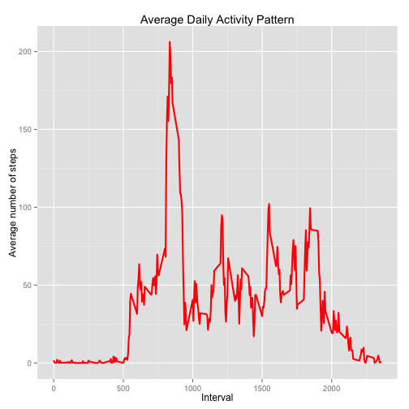
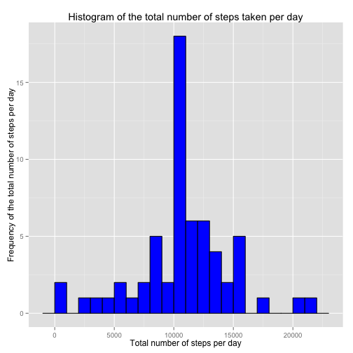
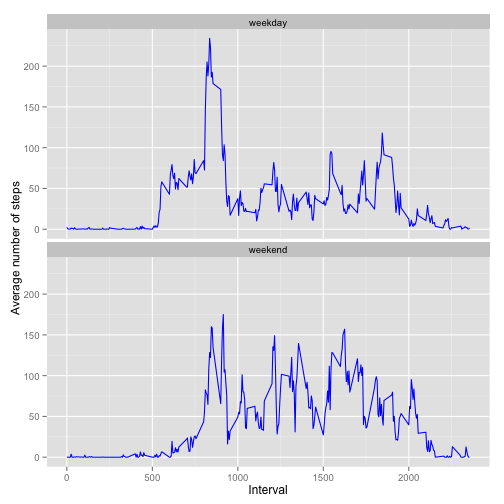

## Reproducible Research: Analysis of Activity monitoring data
#### Author: *Prakruthi P*
#### Github Repository: *https://github.com/prakruthi031/RepData_PeerAssessment1*

#### Date & Time: *Mon Dec 15 02:31:29 2014*

### Introduction
Data from a personal activity monitoring device is analyzed in this project report. The device has collected activity of an individual at 5 minute intervals throughout the day for two months *(October and November 2012)*.

The variables in the dataset are: **steps** (*Number of steps taking in a 5-minute interval*), **date** (*The date on which the measurement was taken in YYYY-MM-DD format*) and **interval** (*Identifier for the 5-minute interval in which measurement was taken*). There are a total of 17,568 observations in this dataset.

### Initializing the R environment

The following code below is used to initialize the R environment. **echo = TRUE** enables the reviewers of this report to view the codes used. **results = 'hold'** to hold the results. The *ggplot2* library is loaded to use its plot capabilities. The *data.table* library is used to load the data and analyze it efficiently.


```r
library(knitr)
opts_chunk$set(echo = TRUE, results = 'hold')
library(data.table)
library(ggplot2)
```

### Loading and preprocessing the data

The data is available and taken from [here](https://d396qusza40orc.cloudfront.net/repdata%2Fdata%2Factivity.zip). Unzip the downloaded file and ensure that the data is available in the current working directory. You can also use the *setwd()* to set the working directory for the project. The date variable is typecasted to the inbuilt *Date* format in R using the function *as.Date()*.


```r
data <- read.csv(file = "activity.csv", header = TRUE, sep = ",", colClasses = c('numeric','character','numeric'))
data$date <- as.Date(data$date,format = "%Y-%m-%d")
```
The summary of the data loaded and processed so far is obtained using the code chunk given below.


```r
str(data)
summary(data)
```

```
## 'data.frame':	17568 obs. of  3 variables:
##  $ steps   : num  NA NA NA NA NA NA NA NA NA NA ...
##  $ date    : Date, format: "2012-10-01" "2012-10-01" ...
##  $ interval: num  0 5 10 15 20 25 30 35 40 45 ...
##      steps             date               interval     
##  Min.   :  0.00   Min.   :2012-10-01   Min.   :   0.0  
##  1st Qu.:  0.00   1st Qu.:2012-10-16   1st Qu.: 588.8  
##  Median :  0.00   Median :2012-10-31   Median :1177.5  
##  Mean   : 37.38   Mean   :2012-10-31   Mean   :1177.5  
##  3rd Qu.: 12.00   3rd Qu.:2012-11-15   3rd Qu.:1766.2  
##  Max.   :806.00   Max.   :2012-11-30   Max.   :2355.0  
##  NA's   :2304
```

Observe that the data has 17568 observations of each of the three variables. The formats of the variables are as required. There are 2304 NA values in the steps variable.

### Analysis of the total number of steps taken per day

The NA missing values are ignored in the calculation of the mean and the median.

The first part of the analysis includes making a histogram to represent the total no. of steps taken each day. We use the *aggregate* function to find the sum of all the steps in each data and order the computed sum according to date. 


```r
hdata <- aggregate(data$steps, list(date = data$date), sum)
colnames(x = hdata) <- c('Date','Steps')
```

We had earlier imported the *ggplot2* library. We use its *geom_histogram* function to draw the histogram and the *labs* function to label the x and y axes and assign a title to the histogram.


```r
ggplot(hdata, aes(x = Steps)) + geom_histogram(binwidth = 1000, colour = "black", fill = "blue") + labs(title = 'Histogram of the total number of steps taken per day', x = "Total number of steps per day", y = "Frequency of the total number of steps per day")
```

 

Next, we compute the mean and median of the total number of steps. We use the *mean* and the *median* function and discard the values which are missing NA.


```r
totalsteps_mean <- mean(hdata$Steps, na.rm = TRUE)
totalsteps_median <- median(hdata$Steps, na.rm = TRUE)
```

Mean of the total number of steps per day: **10766.189**

Median of the total number of steps per day: **10765**

### Analysis of the average daily activity pattern

Next, we will analyze the average daily activity pattern. Here, our aim is to analyze the average number of steps taken, averaged across all days, for every five minute interval. We use the same *aggregate* function as above, this time, applying the average function and grouping by the interval. We use the *ggplot* function to plot the data and use *geom_line* to get layout of the time series plot.


```r
avgdata <- aggregate(data$steps, by = list(date = data$interval), FUN = mean, na.rm = TRUE)
colnames(x = avgdata) <- c('Interval','Steps')
ggplot(avgdata, aes(x=Interval, y=Steps)) + geom_line(color="red", size=1) + labs(title="Average Daily Activity Pattern", x="Interval", y="Average number of steps")
```

 

Inorder to find the 5-minute interval which has the maximum number of steps (averaged across all the days), we use the *which.max()* function on the above obtained averaged Steps variable after aggregation.   


```r
maxindex <- which.max(avgdata$Steps)
maxindexdata <- avgdata[maxindex,]
```

The 5-minute interval which has the maximum number of steps is **835** with **206.1698** steps.

### Analysis of missing values (NA)

The presence of missing days may introduce bias into some calculations or summaries of the data. So far, we have removed the NA values from our analysis. Now, let us find out its impact if it is included in the analysis.

#### Total number of missing values

We use the *is.na()* function to identify the NA values and mark it as logical TRUE. We then use the *sum()* function to sum this logical vector to get the total number of missing values.


```r
no_na <- sum(is.na(data$steps))
```

The total number of NA values in the dataset is **2304**.

#### Strategy for approximating the missing values and including them in the analysis

In order to approximate the missing values, let us replace them with the mean value at the same interval across days.


```r
indexna <- which(is.na(data$steps))
replacevals <- unlist(lapply(indexna, FUN = function(id){interval <- data[id,]$interval
                                          avgdata[avgdata$Interval == interval,]$Steps}))
newsteps <- data$steps
newsteps[indexna] <- replacevals
newdata <- data.frame(steps = newsteps, date = data$date, interval = data$interval)
```

Here, in the above chunk of code, the indexes of missing NA values are identified using the *which(is.na())* functions. The values to be replaced are obtained by iteratively identifying the interval corresponding to the indexes obtained above and the corresponding average no. of steps from the previously computed *avgdata*. This is done using the *lapply()* function. *newdata* contains the new data frame with no missing values. Let us cross check the absence of missing NA values by computing the total number of NA values below.


```r
no_na <- sum(is.na(newdata$steps))
```

The no. of missing NA values in the new dataset is **0**.

#### Histogram of the total number of steps each day

We now draw the histogram of the total number of steps per day using the new data set and find its mean and median using the code written above for the same.


```r
hnewdata <- aggregate(newdata$steps, list(date = newdata$date), sum)
colnames(x = hnewdata) <- c('Date','Steps')
ggplot(hnewdata, aes(x = Steps)) + geom_histogram(binwidth = 1000, colour = "black", fill = "blue") + labs(title = 'Histogram of the total number of steps taken per day', x = "Total number of steps per day", y = "Frequency of the total number of steps per day")
```

 

```r
totalsteps_newmean <- mean(hnewdata$Steps, na.rm = TRUE)
totalsteps_newmedian <- median(hnewdata$Steps, na.rm = TRUE)
```

Mean of the total number of steps per day: **10766.189**

Median of the total number of steps per day: **10766.189**

Now, we observe that the mean remains the same but the median has changed to the same value as the mean value. The peak value has changed because the missing NA values now contribute to the total no. of steps per day. The distribution appears to be approximately the same. 

### Differences in activity patterns between weekdays and weekends

We here observe the average activity patterns between weekends and weekdays. We use the *weekdays()* function to identify the days of the week on the basis of date. We then subset the data based on weekend and weekday using the *subset()* function. We estimate the average number of steps across all days segregated by intervals for the two subsets. We also include a factor variable for the two subsets indicating if the set belongs to weekday or weekend. We then combine the two subsets into a single set using *rbind()* function. 


```r
data$day <- as.factor(weekdays(data$date))
weekend_data <- subset(data, day %in% c("Saturday","Sunday"))
weekday_data <- subset(data, !day %in% c("Saturday","Sunday"))
avgdata_weekend <- aggregate(weekend_data$steps, by = list(date = weekend_data$interval), FUN = mean, na.rm = TRUE)
avgdata_weekday <- aggregate(weekday_data$steps, by = list(date = weekday_data$interval), FUN = mean, na.rm = TRUE)
colnames(x = avgdata_weekend) <- c('Interval','Steps')
colnames(x = avgdata_weekday) <- c('Interval','Steps')
avgdata_weekend$day <- rep("weekend", nrow(avgdata_weekend))
avgdata_weekday$day <- rep("weekday", nrow(avgdata_weekday))
finaldata <- rbind(avgdata_weekday, avgdata_weekend)
ggplot(finaldata, aes(x=Interval, y=Steps)) + geom_line(color="blue", size = 0.5) + facet_wrap(~ day, nrow = 2, ncol = 1) + labs(x="Interval", y="Average number of steps")
```

 

We can see from the graph above that activity on weekdays peak more than the activity on weekends. We also observe that during weekdays, the avergae number of steps peak in few intervals and remain low throughout the other intervals. However, during weekends, the number of steps on an average remains around the same range across all intervals. This shows concentrated activity for a certain duration during weekdays.
