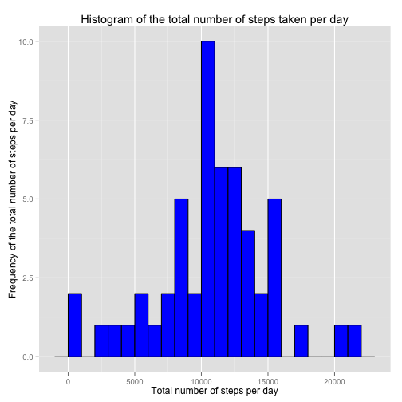

## Reproducible Research: Analysis of Activity monitoring data
#### Author: *Prakruthi P*
#### Github Repository: *https://github.com/prakruthi031/RepData_PeerAssessment1*

#### Date & Time: *Sun Dec 14 20:13:42 2014*

### Introduction
Data from a personal activity monitoring device is analyzed in this project report. The device has collected activity of an individual at 5 minute intervals throughout the day for two months *(October and November 2012)*.

The variables in the dataset are: **steps** (*Number of steps taking in a 5-minute interval*), **date** (*The date on which the measurement was taken in YYYY-MM-DD format*) and **interval** (*Identifier for the 5-minute interval in which measurement was taken*). There are a total of 17,568 observations in this dataset.

### Initializing the R environment

The following code below is used to initialize the R environment. **echo = TRUE** enables the reviewers of this report to view the codes used. **results = 'hold'** to hold the results. The *ggplot2* library is loaded to use its plot capabilities. The *data.table* library is used to load the data and analyze it efficiently.


```r
library(knitr)
opts_chunk$set(echo = TRUE, results = 'hold')
library(data.table)
library(ggplot2)
```

### Loading and preprocessing the data

The data is available and taken from [here](https://d396qusza40orc.cloudfront.net/repdata%2Fdata%2Factivity.zip). Unzip the downloaded file and ensure that the data is available in the current working directory. You can also use the *setwd()* to set the working directory for the project. The date variable is typecasted to the inbuilt *Date* format in R using the function *as.Date()*.


```r
data <- read.csv(file = "activity.csv", header = TRUE, sep = ",", colClasses = c('numeric','character','numeric'))
data$date <- as.Date(data$date,format = "%Y-%m-%d")
```
The summary of the data loaded and processed so far is obtained using the code chunk given below.


```r
str(data)
summary(data)
```

```
## 'data.frame':	17568 obs. of  3 variables:
##  $ steps   : num  NA NA NA NA NA NA NA NA NA NA ...
##  $ date    : Date, format: "2012-10-01" "2012-10-01" ...
##  $ interval: num  0 5 10 15 20 25 30 35 40 45 ...
##      steps             date               interval     
##  Min.   :  0.00   Min.   :2012-10-01   Min.   :   0.0  
##  1st Qu.:  0.00   1st Qu.:2012-10-16   1st Qu.: 588.8  
##  Median :  0.00   Median :2012-10-31   Median :1177.5  
##  Mean   : 37.38   Mean   :2012-10-31   Mean   :1177.5  
##  3rd Qu.: 12.00   3rd Qu.:2012-11-15   3rd Qu.:1766.2  
##  Max.   :806.00   Max.   :2012-11-30   Max.   :2355.0  
##  NA's   :2304
```

Observe that the data has 17568 observations of each of the three variables. The formats of the variables are as required. There are 2304 NA values in the steps variable.

### Analysis of the total number of steps taken per day

The NA missing values are ignored in the calculation of the mean and the median.

The first part of the analysis includes making a histogram to represent the total no. of steps taken each day. We use the *aggregate* function to find the sum of all the steps in each data and order the computed sum according to date. 


```r
hdata <- aggregate(data$steps, list(date = data$date), sum)
colnames(x = hdata) <- c('Date','Steps')
```

We had earlier imported the *ggplot2* library. We use its *geom_histogram* function to draw the histogram and the *labs* function to label the x and y axes and assign a title to the histogram.


```r
ggplot(hdata, aes(x = Steps)) + geom_histogram(binwidth = 1000, colour = "black", fill = "blue") + labs(title = 'Histogram of the total number of steps taken per day', x = "Total number of steps per day", y = "Frequency of the total number of steps per day")
```

 

Next, we compute the mean and median of the total number of steps. We use the *mean* and the *median* function and discard the values which are missing NA.


```r
totalsteps_mean <- mean(hdata$Steps, na.rm = TRUE)
totalsteps_median <- median(hdata$Steps, na.rm = TRUE)
```

Mean of the total number of steps per day: **10766.189**

Median of the total number of steps per day: **10765**

## What is the average daily activity pattern?


## Imputing missing values


## Are there differences in activity patterns between weekdays and weekends?
